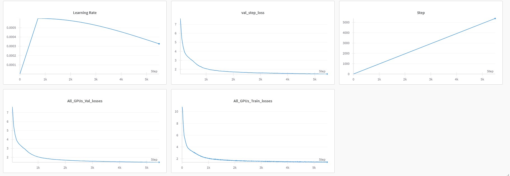
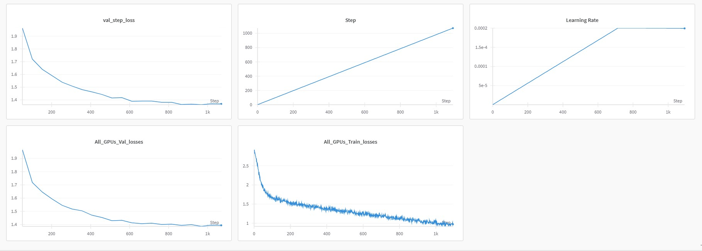
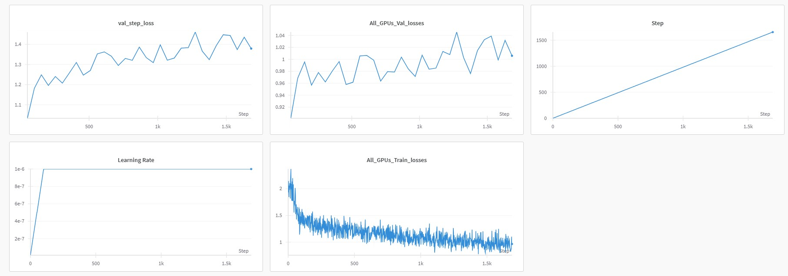
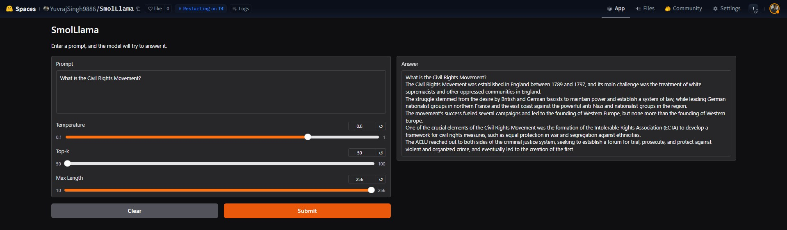
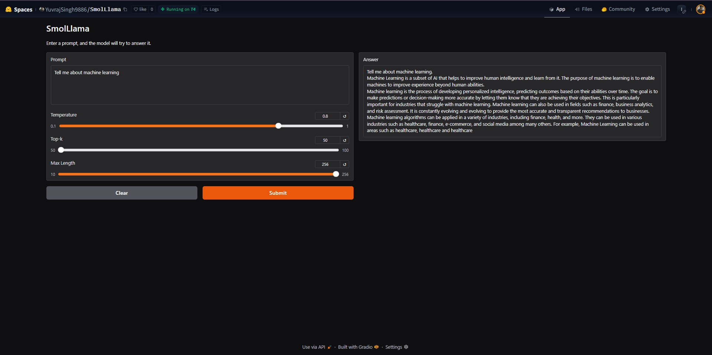

# Introducing SmolLlama - A Smaller Language Model 

- So, I trained a Llama a 130M architecture I coded from ground up to build a small instruct model, going through the below-mentioned stages from scratch.
- Trained on FineWeb dataset form HuggingFace consisting of 15 M texts (10BT snapshot) for a total of full 3 epochs

The three main stages are:

1) Pretraining
2) SFT (Instruction Tuning)
3) Reward Tuning for human-like responses (DPO)

- Test it out here - [SmolLlama](https://huggingface.co/spaces/YuvrajSingh9886/SmolLlama)

- Models have been uploaded on HF!

 ### 1) Pretraining

#### Dataset

 - I used the [FineWeb](https://huggingface.co/datasets/HuggingFaceFW/fineweb?row=0) dataset from HuggingFace (10BT checkpoint) consisting of roughly 15M texts.

  1) Train dataset - 12 M texts
  2) Val dataset - 3M texts


 ### 2) SFT

#### Dataset

 - I used the [alpaca](https://huggingface.co/datasets/yahma/alpaca-cleaned) dataset from HuggingFace consisting of roughly 52k texts.

  1) Train dataset - 45k texts
  2) Val dataset - 5k texts


 ### 3) Reference Alignment

#### Dataset

 - I used the [Ultrafeedback](https://huggingface.co/datasets/trl-lib/ultrafeedback_binarized) dataset from HuggingFace consisting of roughly 62.1K texts.

  1) Train dataset - 56K texts
  2) Val dataset - 6K texts


---

####  ModelArgs (Hyperparameters)


| Parameter                      | Description                                                                 | Default Value                     | Type      |
|--------------------------------|-----------------------------------------------------------------------------|-----------------------------------|-----------|
| `epochs`                       | Number of training epochs                                                   | `4`                               | `int`     |
| `block_size`                   | Size of each block (context length)                                         | `512`                             | `int`     |
| `batch_size`                   | Batch size for training                                                    | `64`                              | `int`     |
| `inference`                    | Inference mode (not specified)                                              | `None`                            | `None`    |
| `embeddings_dims`              | Dimensionality of embeddings                                                | `512`                             | `int`     |
| `attn_dropout`                 | Dropout rate for attention layers                                           | `0.1`                             | `float`   |
| `no_of_heads`                  | Number of attention heads                                                   | `8`                               | `int`     |
| `dropout`                      | Dropout rate for the model                                                  | `0.1`                             | `float`   |
| `val_epochs`                   | Number of validation epochs                                                 | `2`                               | `int`     |
| `max_lr`                       | Maximum learning rate                                                       | `6e-4`                            | `float`   |
| `no_of_decoder_layers`         | Number of decoder layers                                                    | `8`                               | `int`     |
| `weight_decay_optim`           | Weight decay for the optimizer                                              | `0.1`                             | `float`   |
| `beta_1`                       | Beta 1 for Adam optimizer                                                   | `0.9`                             | `float`   |
| `beta_2`                       | Beta 2 for Adam optimizer                                                   | `0.95`                            | `float`   |
| `clip`                         | Gradient clipping value                                                     | `1.0`                             | `float`   |
| `device`                       | Device to run the model (`cuda` or `cpu`)                                   | `'cuda'`                          | `str`     |
| `no_kv_heads`                  | Number of key-value heads                                                   | `2`                               | `int`     |
| `vocab_size`                   | Size of the vocabulary                                                      | `50304`                           | `int`     |
| `eps`                          | Epsilon value for numerical stability                                       | `1e-5`                            | `float`   |
| `dtype`                        | Data type for tensors (`bfloat16` if supported, else `float16`)             | `'bfloat16'` or `'float16'`       | `str`     |
| `save_checkpoint_dir`          | Directory to save model checkpoints                                         | `"checkpoints"`                   | `str`     |
| `prompt`                       | Default prompt for inference                                                | `"Once upon a time"`              | `str`     |
| `save_checkpoint_iter`         | Save checkpoint every N iterations                                         | `50`                              | `int`     |
| `total_iters`                  | Total number of training iterations                                        | `10000`                           | `int`     |
| `eval_iters`                   | Evaluate model every N iterations                                          | `50`                              | `int`     |
| `eval_check`                   | Check evaluation metrics every N iterations                                | `100`                             | `int`     |
| `warmup_iters`                 | Number of warmup iterations for learning rate scheduling                   | `700`                             | `int`     |
| `min_lr`                       | Minimum learning rate (10% of `max_lr`)                                     | `0.1 * max_lr`                    | `float`   |
| `lr_decay_iters`               | Number of iterations for learning rate decay                               | `10000`                           | `int`     |
| `total_batch_size`             | Total batch size across all devices                                         | `524288`                          | `int`     |
| `micro_batch_size`             | Micro batch size per device                                                | `batch_size`                      | `int`     |
| `gradient_accumulation_steps`  | Gradient accumulation steps                                                 | `total_batch_size // (micro_batch_size * (block_size * torch.cuda.device_count()))` | `int` |
| `no_kv_heads`                  | Number of key-value heads                                                   | `2`                               | `int`     |
---
### Hardware Setup

 - Used DPP using Pytorch torchrun consisting of 2x H100s SXM (80GB VRAM each) rented on runpod.io
 - The model is a 1.1GB in size but needs around 1.1 GB of VRAM when loaded in fp32 precision
---

#### Frameworks:
**Pytorch**

--- 

#### Epochs/Steps
- Iterations (train) = 6K (gradient accumulation of 0.5M tokens)

- Val iterations = every 50 steps
---

#### Losses

 - Result - Pretraining  

   Train loss: 3.77 (stagnated)  
   Val Loss: 3.80 (stagnated)  


 - Result - SFT  

   Train Loss: 1.01  
   Val Loss: 1.39  

 - Result - DPO  

   Train Loss:  0.96  
   Val Loss: 1.05  

---

#### Screenshots of the loss curves

- Pretrain



- SFT



- DPO




--- 
#### Output

- Sample Ouput




---

### Local setup


### Requirements


```python
git [clone the repo](https://github.com/YuvrajSingh-mist/SmolLlama.git)
cd SmolLlama
bash ./install.sh

```
- A wandb.ai account for plotting graphs for your loss curves

- On your terminal run
```python
wandb login
```

- Enter the api key and follow the instructions and once you are succesfully logged in follow the given steps


- Download the model

Can use 'P or F or D' to download the model, stands for pretarined, fine tuned and preference alignment models resp.
```python
python donwload_model_weight.py -D
```


---

### Running 


#### Training a model

- Kindly hange 'device' to any of your available cuda gpus.

To run:

```python
cd SmolLlama
```

Prepare the dataset. You can set either "tinystories" or "fw" or "dpo" to True to downalod the corresponding datasets.

```python

python data.py --tinystories


```

```python
bash ./install.sh
```

Download the weights of the model

```python

python download_model_weight.py -sft/dpo/pretrained

```

Train the model

Now run the following command (Use 'P' for pretraining/SFT and 'D' for DPO)

```python
torchrun --standalone --nproc_per_node=gpu trainer.py \  
    --train P \
    --epochs 4 \
    --beta 0.1 \
    --block_size 256 \
    --batch_size 128 \
    --embeddings_dims 512 \
    --attn_dropout 0.1 \
    --no_of_heads 8 \
    --dropout 0.1 \
    --val_epochs 2 \
    --max_lr 6e-4 \
    --no_of_decoder_layers 16 \
    --weight_decay_optim 0.1 \
    --beta_1 0.9 \
    --beta_2 0.95 \
    --clip 1.0 \
    --device cuda \
    --no_kv_heads 2 \
    --vocab_size 50304 \
    --eps 1e-5 \
    --dtype "bfloat16" \
    --save_checkpoint_dir "checkpoints" \
    --prompt "Once upon a time" \
    --save_checkpoint_iter 50 \
    --total_iters 20000 \
    --eval_iters 50 \
    --eval_check 100 \
    --warmup_iters 700 \
    --min_lr 6e-5 \
    --lr_decay_iters 20000 \
    --total_batch_size 524288 \
    --micro_batch_size 128 \
    --gradient_accumulation_steps 4096
    --max_length 100 \
    --temperature 0.8
```


#### Inference on a model

 - First method:  
 
```python
python inference_sft.py --prompt "Follow the given instruction carefully. What was the Civil Rights Movement?" --max_length 256 --temperature 0.8  
```

 - Second method (through Huggingface):  

   <!-- python download_model_weight.py -sft/dpo/pretrained  -->  
  ```python

  cd gradio/  
  
  pip install gradio  

  python app.py

  ```

